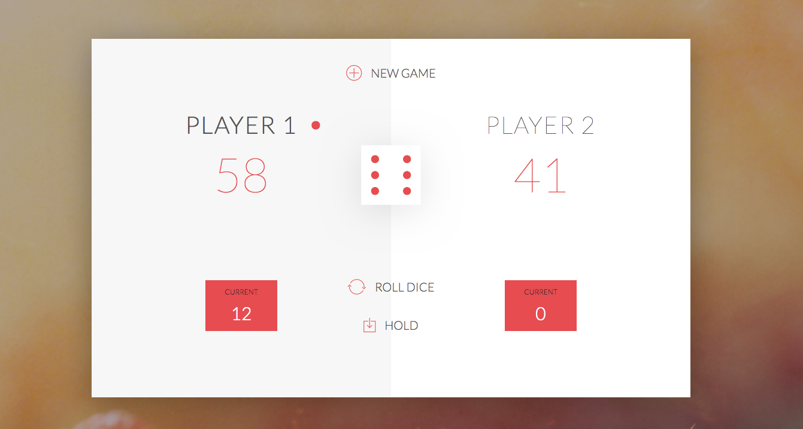

# PIG GAME

## GAME RULES:

- The game has 2 players, playing in rounds
- In each turn, a player rolls a dice repeatedly until either a 1 is rolled or player decides to hold and pass on the turn to its opponent. Each result gets added to the ROUND score
...* If the player rolls a 1, all accumulated ROUND score gets lost. After that, it's the next player's turn
...* The player can choose to 'Hold', which means that their ROUND score gets added to their GLOBAL score. After that, it's the next player's turn
- The first player to reach 100 points on GLOBAL score wins the game

## License and Copyright

Copyright (c) 2019 Em Estabillo